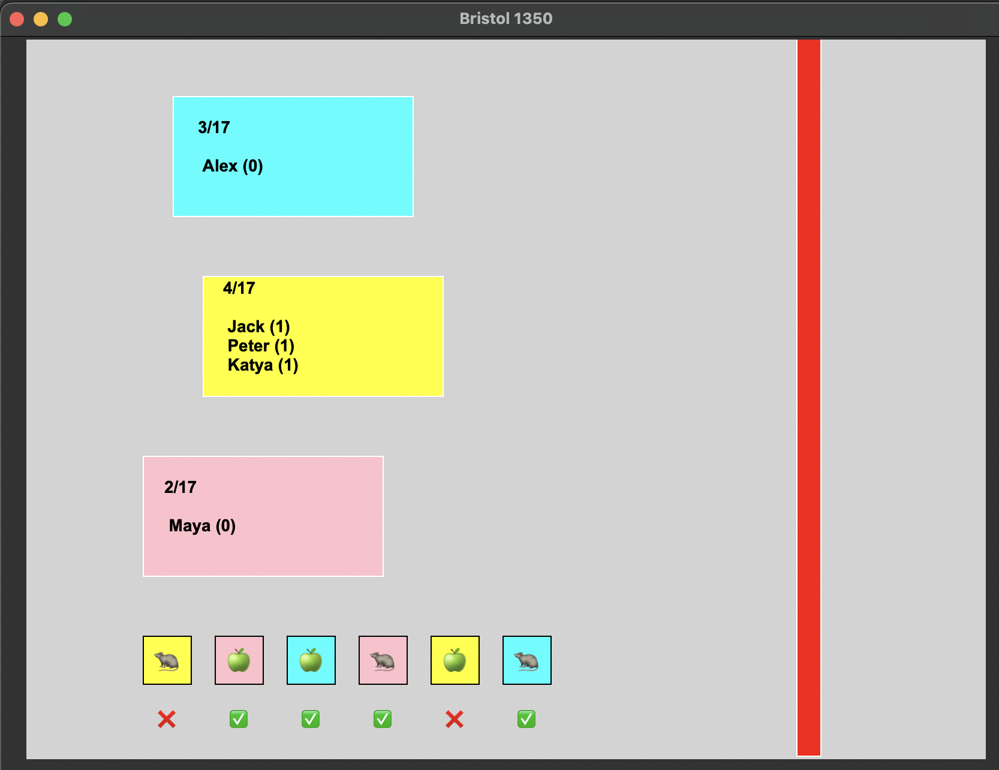
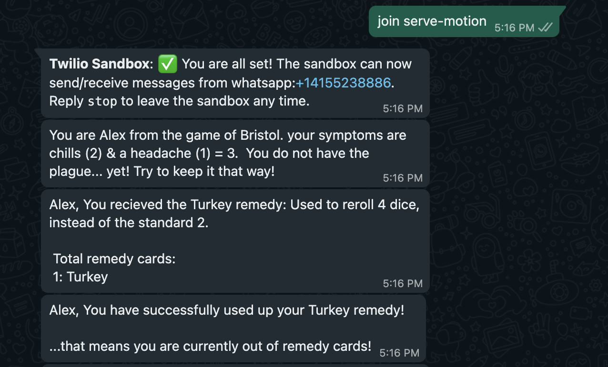
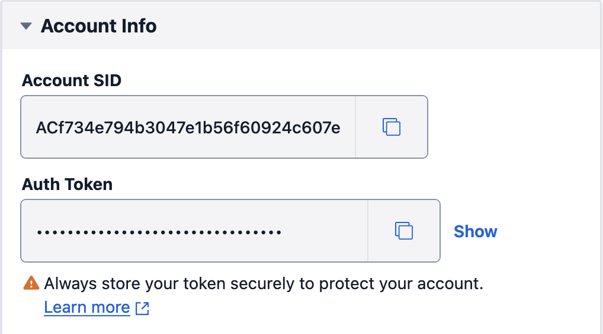

#### Disclaimer: This is not an official implementation!

[Bristol 1350](https://facadegames.com/products/bristol-1350) is a big hit in the Sweeten household! We always play a few games during family get togethers. During the holiday season of 2023, I forgot to bring a copy of the game 🤦 This repo is the result of spending my freetime over the holidays to make a digital copy of the game.

If you're unfamiliar with how to play, you can view the official [rules here](https://gamers-hq.de/media/pdf/60/66/e2/Bristol_PnP_Rules_1.pdf). Gameplay consists of a command line interpreter, which announces game updates and allows users to enter input commands, as well as a GUI showing the cart progress and dice rolling, rendered using [tkinter](https://docs.python.org/3/library/tkinter.html). Values that are kept secret from other players, such as symptoms and remedy cards, are sent via text message to all registered players mobile devices. This is done using [Twilio](https://login.twilio.com/u/signup?state=hKFo2SA4d09LV1BLM3lsNlFINXNfQU1oVWhzSFJ5Q1RnbGlNVaFur3VuaXZlcnNhbC1sb2dpbqN0aWTZIFptY1F6bmp6bVJ4UWw2TVRtemNkZk1TVktCZDF5TG9Vo2NpZNkgTW05M1lTTDVSclpmNzdobUlKZFI3QktZYjZPOXV1cks).





# Installation
```
git clone https://github.com/alexsweeten/bristol1350.git
cd bristol1350
python -m pip install .
```

# Setup Twilio
In order to send text messages to users, you must have a functioning [Twilio account](https://login.twilio.com/u/signup?state=hKFo2SA4d09LV1BLM3lsNlFINXNfQU1oVWhzSFJ5Q1RnbGlNVaFur3VuaXZlcnNhbC1sb2dpbqN0aWTZIFptY1F6bmp6bVJ4UWw2TVRtemNkZk1TVktCZDF5TG9Vo2NpZNkgTW05M1lTTDVSclpmNzdobUlKZFI3QktZYjZPOXV1cks). As of December 2023, Twilio gives all new users $15 in free credits, enough for a bunch of free games.

Once registered for a Twilio account, you will need to add your Twilio account SID and authorization token into `registration.yml`:



```
twilio_info:
  account_sid: <YOUR_SID_HERE>
  auth_token: <YOUR_TOKEN_HERE>
```

Finally, you will need to add each players name and phone number into `registration.yml`

```
registered_users:
  Player1: '5555555555'
  Player2: '6666666666'
```

# Play
To Play a game of Bristol, launch with `bristol -p/--players`, followed by the name of each player participating (1-9 players supported)
```
bristol -p Player1 Player2 Player3 ...
```

To Play a test game that sends mingle and symptom information to the CLI instead of SMS messages, append `-t/--test` (users will still need to be in `registration.yml`
```
bristol -p Player1 Player2 Player3 -t
```

You can adjust the length of the goal (ie. the number of spaces a cart has to move in order to exit the city) with the `-f/--finish` flag. Default is 17.
```
bristol -p Player1 Player2 Player3 -f 10
```

Finally, special characters can be assigned to each player in-game with the `-c/--character` flag.
```
bristol -p Player1 Player2 Player3 -c
```

# Rules
In Bristol 1350, you are a peasant trying to escape the city during the height of the Black Plague. At the start of the game, you are randomly assigned into 1 of 3 carts and given 2 status conditions. Your objective is to escape in your cart from Bristol plague-free. If at any point your two status conditions total 6 or higher, you have the plague! 

During each turn, 6 dice will be rolled. Your cart will move a total number of spaces equal to the number of dice rolled matching your carts color. If you are in a cart where two of the matching dice are rats, that means your cart will mingle at the end of the turn. You want to keep mingling to a minimum, as it will increase your chances of developing the plague! 

There are some differences between this implementation, and the official [rules here](https://gamers-hq.de/media/pdf/60/66/e2/Bristol_PnP_Rules_1.pdf):

- Remedy cards only contain 1 remedy, instead of a choice of 2.
- Leeches and Pomander are not included in the game (to include in a future update).
- Turkey is a new remedy: It allows the user to reroll 4 dice instead of the standard 2.
- There are 9 possible characters in the game:
  - Sheriff: You can view 1 symptom of a player on a different cart.
  - Friar: You can change 1 die to be exactly what you want.
  - Mason: You can reroll 1 die, then lock one die.
  - Chandler: You can draw a random symptom and choose to replace it with one of your own.
  - Countess: You can draw 2 remedies and keep 1 of them.
  - Knight: You can move any player up to the front of their current cart.
  - Outlaw (different effect!): You have a 1/3 chance of gaining a free remedy card.(happens automatically at the start of your turn and is in addition to your main action).
  - Drunkard (new!): You can turn 1 die into a rat of your current cart color. You are also immune from mingling whenever you use this.
  - Rat King (new!): You can replace up to two apple dice with a rat of the same cart color.

## Actions
- (R) Reroll Dice: You can reroll up to 2 dice.
- (A) Ability: Use your special character ability (only available with characters unlocked)
- (M) Movement: Take a movement action
  - (P) Push: Push the last person in your cart off. 
  - (E) Elbow: Elbow your way to the front of your cart.
  - (J) Jump: Jump to the back of the next available cart.
- (D) Draw a remedy card. You start the game with 1, and can hold a maximum of 3 throughout the game:
    * Arsenic: Select two dice to lock. Use during the action phase.
    * Chicken: When rerolling dice, choose to reroll them up to 3 more times. Use during the action phase when rerolling two dice.
    * Crushed Emeralds: Take an extra movent action: Elbow (E), Push (P) or Jump (D). Use during the action phase.
    * Whip: Prevent someone from jumping into your cart, elbowing past you, or pushing you off your cart. Use reactively.
    * Turkey: Reroll 4 dice instead of the usual 2.
- (U) Use a Remedy Card
  - (A) Use Arsenic
  - (C) Use Crushed Emerald
  - (T) Use Turkey
- (V) View current dice & character ability.
- (S) Skip your turn

# Known Bugs
- Carts can currently hold >3 people.
- Jumping to a full cart doesn't swap first of second cart with last of first cart.
- In carts that die from the plague once reaching the end, one person ends up surviving.
- When elbowing people, people who are behind you can respond with a whip.
- Lock doesn't work against turkey (and probably other dice rolling effects)
- If outlaw backs out of an action, they get another chance for a free remedy.
